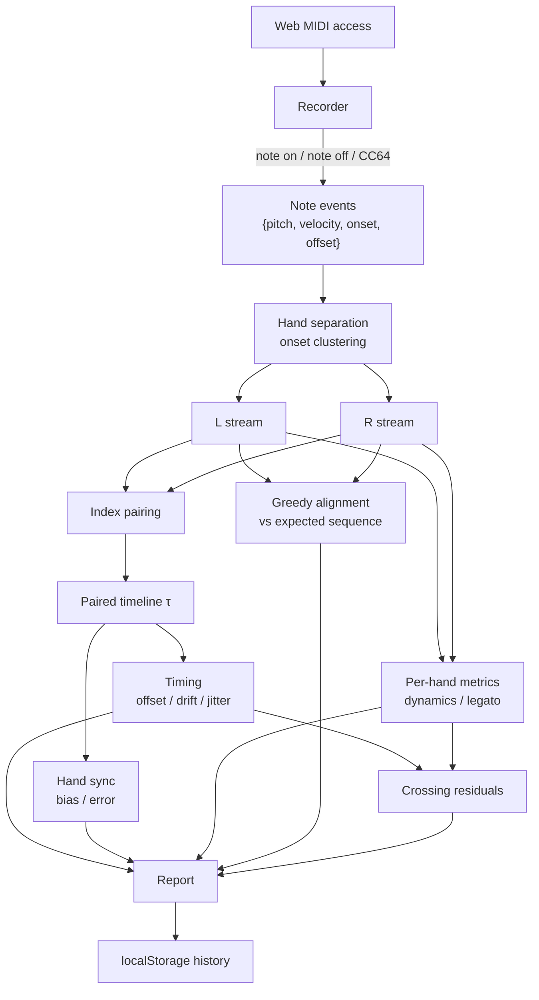

# Scale Practice Feedback — Full Documentation

A browser tool that listens to a digital piano over MIDI, scores a two-hand scale
exercise, and returns a per-note diagnostic report.

This document covers the objective, the complete metric mathematics, what is built,
what is deliberately not built yet, and every threshold and heuristic the code uses.

---

## Table of contents

1. [Objective](#1-objective)
2. [Design constraints and why](#2-design-constraints-and-why)
3. [The exercise](#3-the-exercise)
4. [System architecture](#4-system-architecture)
5. [MIDI input layer](#5-midi-input-layer)
6. [Hand separation](#6-hand-separation)
7. [Metrics — full mathematics](#7-metrics--full-mathematics)
8. [Report UI](#8-report-ui)
9. [Findings engine](#9-findings-engine)
10. [Data model](#10-data-model)
11. [Code map](#11-code-map)
12. [Degenerate cases and guards](#12-degenerate-cases-and-guards)
13. [Implementation status](#13-implementation-status)
14. [Roadmap](#14-roadmap)
15. [Open questions](#15-open-questions)
16. [Testing](#16-testing)
17. [Running and deploying](#17-running-and-deploying)

---

## 1. Objective

### The problem

A player practising scales alone cannot hear most of what is wrong with their playing.
Three faults in particular are effectively invisible from the bench:

- **Hand synchronisation.** A consistent 10–15 ms lag between the hands is inaudible
  as a discrete event, but it is precisely what makes a scale sound smeared rather
  than clean. Neither the player nor most teachers can reliably detect it by ear.
- **Thumb-crossing accents.** The thumb is heavier than the other fingers, so crossings
  land louder and later. Because the crescendo is *supposed* to be rising, a loud thumb
  note sounds plausible in context and passes unnoticed.
- **Dynamic shape.** "Start soft, grow to the top, come back symmetrically" is easy to
  state and hard to verify. Players routinely believe they executed a smooth crescendo
  when they in fact executed three jumps and a dip.

MIDI exposes all of this exactly. The instrument reports every onset time, release time
and key velocity with millisecond resolution, which means these faults are directly
measurable even though they are not audible.

### What the tool does

The player sets a tempo, plays a two-octave C major scale hands together, and gets back:

- Raw, uncalibrated metrics for timing, note accuracy, dynamics, hand sync, articulation
  and hand balance.
- A per-note strip showing *where* in the scale each fault occurred, rather than a single
  averaged number.
- At most three prioritised plain-English findings.
- A stored history so the player can compare against their own previous runs.

### Design principle: location over magnitude

Every metric is computed per note before it is averaged. Averaging is what destroys the
location information, and location is what changes practice behaviour. "Your jitter is
0.09" tells a player nothing actionable; "your crescendo dipped at notes 4 and 9" sends
them to a specific bar.

### Non-goals for v1

- **No composite 0–100 score.** Collapsing metrics in different units onto one scale
  requires anchor points, and nothing in the mathematics supplies them — they are a
  judgement about what counts as good playing, and that judgement needs real runs from
  real players to calibrate. Self-comparison against your own history needs no
  calibration and is more motivating than an absolute grade.
- **No accounts, no backend.** Sign-up is the wall that non-technical users bounce off.
- **No audio analysis.** The app never receives audio, only MIDI.

---

## 2. Design constraints and why

| Decision | Value | Reason |
|---|---|---|
| Runtime | Browser, Web MIDI API | Zero install |
| Distribution | Static site over HTTPS | Web MIDI requires a secure context |
| Backend | None | Not needed for v1 |
| Accounts | None | Sign-up is the drop-off point |
| Persistence | `localStorage`, JSON, manual export | No server to store anything on |
| Browsers | Chrome / Edge / Opera; Firefox with the site-permission add-on | Safari has never shipped Web MIDI |
| iOS / iPadOS | Unsupported, all browsers | All iOS browsers are WebKit underneath |
| Build step | None | Plain ES modules; deploys as-is |

### Onboarding

Exactly three steps, no more:

1. Plug in the USB cable.
2. Open the link in Chrome.
3. Click Allow.

### Unsupported-browser detection

On load the app checks `navigator.requestMIDIAccess === undefined` and, if the API is
missing, shows a plain-language message naming Chrome rather than failing silently.

---

## 3. The exercise

### Configuration

| Setting | Default | Notes |
|---|---|---|
| Scale root + mode | C major | v1 ships C major only |
| Octaves $n$ | 2 | 1, 2, 3, 4 |
| Target tempo | *user must set* | Required — no default is honest, and $T$ depends on it |
| Notes per beat | 2 (eighths) | 1, 2 or 4 |
| Metronome | off | **Setting is currently inert — see [§13](#13-implementation-status)** |
| Hand interval $\Delta$ | 12 semitones | Configurable |
| Sustain pedal | not allowed | Detected and flagged |

### Instructions shown before the run

- Hands together.
- Top note is played **once**, not twice.
- No sustain pedal.
- Start soft, grow to loudest at the top, return symmetrically.

The pedal is disallowed because sustain masks every articulation and evenness flaw —
with the pedal down, legato and timing measurements stop meaning anything.

### Note count

For $n$ octaves the ascending run is $7n + 1$ notes. Playing up and down with the top
note struck once gives

$$N = 14n + 1$$

and the peak sits at 0-based index

$$k = 7n$$

For the default $n = 2$: $N = 29$, $k = 14$.

### Pitch sequence generation

Let $\rho$ be the root MIDI pitch (C4 = 60) and $I$ the interval set of the mode. For
major:

$$I = [0, 2, 4, 5, 7, 9, 11]$$

The ascending array $A$ has length $7n+1$:

$$A_j = \rho + 12\left\lfloor \frac{j}{7} \right\rfloor + I\!\left[j \bmod 7\right], \qquad j = 0, 1, \dots, 7n$$

The full up-and-down right-hand sequence folds $A$ back on itself, skipping the repeat
of the top note:

$$P^{RH}_i = \begin{cases} A_i & 0 \le i \le 7n \\[4pt] A_{14n - i} & 7n < i \le 14n \end{cases}$$

The left hand is the right hand transposed down by the hand interval:

$$P^{LH}_i = P^{RH}_i - \Delta$$

Both hands move in the same direction (parallel motion), striking note $i$ at the same
moment. So one run produces $N$ onsets per hand, $2N$ MIDI note events in total.

### Fingering and thumb crossings

#### Why a one-octave array cannot simply be tiled

The finger on the root note **depends on where in the run that root falls**. Ascending
RH C major uses 1,2,3,1,2,3,4 per octave with the thumb landing on *every* octave
boundary; finger 5 appears only on the very last note of the whole run. So two octaves is

$$1,2,3,1,2,3,4,\underbrace{1}_{\text{C5}},2,3,1,2,3,4,5$$

and **not** $\ldots,4,\mathbf{5},2,3,\ldots$ — putting 5 on the joining C5 would both be
wrong fingering and, worse, hide a genuine thumb crossing at that note from the analysis.
The left hand mirrors this: 5 appears only on the lowest note, and the thumb lands on
each octave boundary.

#### Storage model

Each scale/hand stores a 7-note repeating **cycle** plus the two notes that break it:

```js
export const FINGERINGS = {
  C: { major: {
    RH: { cycle: [1, 2, 3, 1, 2, 3, 4], first: 1, last: 5 },
    LH: { cycle: [1, 4, 3, 2, 1, 3, 2], first: 5, last: 1 },
  }},
};
```

| Field | Meaning |
|---|---|
| `cycle` | Finger per scale degree when passing **through** that degree mid-run |
| `first` | Finger on the lowest note of the run (differs from `cycle[0]` for LH) |
| `last` | Finger on the highest note of the run (differs from `cycle[0]` for RH) |

The ascending fingering $F$, of length $7n+1$, is then

$$F_j = \begin{cases}
\texttt{first} & j = 0 \\[4pt]
\texttt{cycle}\!\left[\,j \bmod 7\,\right] & 0 < j < 7n \\[4pt]
\texttt{last} & j = 7n
\end{cases}$$

and is folded for the descent exactly as the pitches are, giving length $14n+1$.

This generalises to scales that break the pattern at different degrees — F major RH needs
`cycle: [1,2,3,4,1,2,3]` (thumb after the B♭), B major LH needs `first: 4` — with no code
change. Some scales may eventually need a distinct descending cycle too; see §14.

#### Deriving crossings

Crossings are **derived**, not hardcoded — a crossing is any place the finger number does
not move by exactly one:

$$C = \left\{\, j \ge 1 \;:\; |F_j - F_{j-1}| \neq 1 \,\right\}$$

This is why adding a scale means adding one table entry and nothing else. The crossing
indices are known before the player touches a key.

Worked example, C major, 1 octave, right hand. The folded fingering is

$$F = [1,2,3,1,2,3,4,5,4,3,2,1,3,2,1]$$

Differences of 1 everywhere except $j=3$ ($|1-3| = 2$, the thumb passing under on the
way up to F) and $j=12$ ($|3-1| = 2$, the third finger crossing over on the way back
down). So $C = \{3, 12\}$.

For 2 octaves the derived sets are

$$C_{RH} = \{3, 7, 10, 19, 22, 26\} \qquad C_{LH} = \{5, 8, 12, 17, 21, 24\}$$

$C_{RH}$ now correctly includes $j=7$ and $j=22$ — the ascending and descending octave
joins at C5, where the thumb crosses.

The hands cross at **different** indices, so crossings are computed per hand, never
shared.

---

## 4. System architecture



Run boundaries are explicit **Start** and **Stop** buttons rather than auto-detection
from the first and last expected note. Buttons are simpler and far less error-prone for
the target users, and they make a mistimed first note a recoverable mistake rather than
a silently corrupted run.

---

## 5. MIDI input layer

### Message handling

```js
const [status, data1, data2] = msg.data;
const type = status & 0xf0;
```

| Message | Condition | Handling |
|---|---|---|
| Note on | `type === 0x90 && data2 > 0` | Open a note: record pitch, velocity, onset |
| Note off | `type === 0x80` | Close the matching open note, record offset |
| Note off (implicit) | `type === 0x90 && data2 === 0` | **Also a note-off** |
| Sustain pedal | `type === 0xb0 && data1 === 64` | Value > 63 sets the pedal flag |

> **Note-on with velocity 0 must be treated as note-off.** Many instruments send this
> instead of `0x80`. Missing it is the single most common Web MIDI bug — notes never
> close, every offset is wrong, and legato measurement silently collapses.

### Event record

Each completed note produces:

$$\{\, \text{pitch},\ \text{velocity},\ \text{onset},\ \text{offset} \,\}$$

Onset and offset are `msg.timeStamp` in milliseconds (floating point). Velocity is the
MIDI note-on velocity, an integer in $[0, 127]$.

Open notes are tracked in a `Map` keyed by pitch. A note-off with no matching note-on
is ignored (this happens when a run starts mid-key-press). A second note-on for a pitch
already sounding overwrites the first — acceptable for scale practice, where genuine
retriggering of a held key does not occur.

---

## 6. Hand separation

The instrument sends **one merged stream with no hand marker**. The two hands must be
separated before any per-hand or sync metric can be computed.

### Why the obvious approach fails

The natural approach — and the one originally specified — is a fixed pitch threshold at
the midpoint between the lowest expected left-hand and right-hand notes:

$$\sigma = \frac{(\rho - \Delta) + \rho}{2} = \rho - \frac{\Delta}{2}$$

$$\text{hand}(p) = \begin{cases} L & p < \sigma \\ R & p \ge \sigma \end{cases}$$

This works for a one-octave exercise and breaks for anything larger. The two hands span

$$\text{RH} \in [\rho,\ \rho + 12n] \qquad \text{LH} \in [\rho - \Delta,\ \rho + 12n - \Delta]$$

which overlap whenever

$$12n > \Delta$$

At the **default configuration** ($n = 2$, $\Delta = 12$) that condition is $24 > 12$ —
the ranges overlap across a full octave. Concretely, in C major: the right hand covers
MIDI 60–84, the left hand covers 48–72, and $\sigma = 54$. Every left-hand note at or
above 54 is misclassified as right hand — **21 of the 29 left-hand notes**. The result
is a left stream of 8 events and a right stream of 50, which trips the length-mismatch
check, discards timing and sync entirely, and reports near-zero note accuracy for a
run that may have been perfect.

The original specification flagged this as an open question requiring verification
against real playing before being hardcoded. The verification above is arithmetic and
does not need a keyboard: the approach cannot work at the default settings.

### What is implemented instead

`splitHandsByOnset` separates hands by **simultaneity** rather than absolute pitch.
Because the exercise is played hands together, each beat produces one left and one
right onset within a small time window of each other.

1. Sort all note events by onset.
2. Walk the sorted list, accumulating a cluster while

   $$t_{\text{event}} - t_{\text{cluster start}} \le w$$

   and starting a new cluster otherwise.
3. The window is scaled to the tempo and clamped:

   $$w = \operatorname{clamp}\!\left(\frac{T}{2},\ 40\ \text{ms},\ 200\ \text{ms}\right)$$

   Half a beat is wide enough to catch a badly unsynchronised pair and narrow enough
   that it can never swallow the following beat.
4. Within each cluster of exactly two events, the **lower pitch is the left hand** and
   the higher is the right.

This is correct regardless of how far the hands' pitch ranges overlap, because it never
consults absolute pitch across beats — only the relative order of two notes struck
together.

Note that this makes the required tempo setting load-bearing in a second way: $T$ sets
the clustering window as well as the timing target.

### Fallbacks

| Cluster size | Handling |
|---|---|
| 2 | Lower pitch → L, higher → R (the normal case) |
| 1 | Classified by the fixed threshold $\sigma$ — one hand missed the beat |
| >2 | Lowest → L, highest → R; any middle events fall back to $\sigma$ |

The fixed-threshold function is retained in the codebase for exactly this fallback role.

### Known limitation

If a player's hands are consistently more than $w$ apart, clusters degrade into
singletons and the fallback threshold takes over — reintroducing the original problem.
At 80 BPM in eighths, $w = 187.5$ ms, which is far beyond any plausible hand spread, so
this is unlikely in practice. It has not been validated against a real player who
struggles badly with synchronisation, which is the one population where it might matter.

### Pairing

After separation the two streams are paired index by index: $L_i$ with $R_i$. Pairing
assumes neither hand dropped a note. **If the two streams differ in length the run is
flagged and the sync-dependent metrics are skipped rather than mispaired** — a single
dropped note would otherwise shift every subsequent pair and produce confidently wrong
numbers.

---

## 7. Metrics — full mathematics

### 7.0 Notation

For hand $h \in \{L, R\}$ and note index $i \in [0, N)$:

| Symbol | Meaning | Units |
|---|---|---|
| $t_i^h$ | onset time | ms |
| $o_i^h$ | offset (release) time | ms |
| $v_i^h$ | MIDI velocity | integer $[0, 127]$ |
| $p_i^h$ | MIDI pitch | integer |
| $N$ | note count, $14n+1$ | — |
| $k$ | peak index, $7n$ | — |
| $\Delta$ | hand interval | semitones |

The **paired onset**, used wherever a single timeline is needed:

$$\tau_i = \frac{t_i^L + t_i^R}{2}$$

**Inter-onset intervals:**

$$\mathrm{IOI}_i = \tau_{i+1} - \tau_i, \qquad i \in [0, N-1)$$

**Target inter-onset interval** from the user's tempo:

$$T = \frac{60000}{\text{BPM} \times \text{notesPerBeat}} \quad [\text{ms}]$$

For 80 BPM in eighth notes: $T = 60000 / 160 = 375$ ms.

All statistics use the **population** form (dividing by $n$, not $n-1$).

---

### 7.1 Timing — three-way decomposition

**Nothing is exempt.** The turnaround note at the top is scored like every other note;
the run is expected to be metronomically even throughout. Players habitually slow down
at the turn and count it as musical, which is why it is explicitly not excused here.

The single number "how even was it" conflates three different faults that need three
different fixes. They are separated by fitting a line to the IOIs against note index:

$$\mathrm{IOI}_i \approx a + b\,i$$

Least squares, with $\bar{\imath}$ the mean index and $\overline{\mathrm{IOI}}$ the mean
interval:

$$b = \frac{\sum_i (i - \bar{\imath})(\mathrm{IOI}_i - \overline{\mathrm{IOI}})}{\sum_i (i - \bar{\imath})^2}
\qquad
a = \overline{\mathrm{IOI}} - b\,\bar{\imath}$$

Residuals — what the line does not explain:

$$r_i = \mathrm{IOI}_i - (a + b\,i)$$

The three components, each normalised by $T$ so they are dimensionless and comparable
across tempos:

$$\boxed{\ \text{offset} = \frac{\overline{\mathrm{IOI}} - T}{T}\ }
\qquad \text{signed: } + \text{ slow}, - \text{ rushed}$$

$$\boxed{\ \text{drift} = \frac{b\,(N-1)}{T}\ }
\qquad \text{signed: } + \text{ slowing}, - \text{ speeding}$$

$$\boxed{\ \text{jitter} = \frac{\sqrt{\dfrac{1}{N-1}\displaystyle\sum_i r_i^2}}{T}\ }
\qquad \text{unsigned}$$

| Component | Measures | Fix it by |
|---|---|---|
| `offset` | Playing the whole exercise at the wrong tempo | Setting the metronome and matching it |
| `drift` | Failing to hold one tempo across the run | Practising with a reference |
| `jitter` | Individual notes landing early or late | Slowing down until notes are even |

`drift` multiplies the per-note slope $b$ by the span of the run, so it reads as "the
total tempo change from first interval to last, as a fraction of a beat."

#### Why the three components exactly account for the error

The claim that they don't overlap isn't a hand-wave; it follows from the fit. Since
$a = \overline{\mathrm{IOI}} - b\,\bar{\imath}$, the fitted line can be rewritten as

$$a + b\,i = \overline{\mathrm{IOI}} + b\,(i - \bar{\imath})$$

Substituting that into $r_i = \mathrm{IOI}_i - (a + b\,i)$ and rearranging gives the
total error of each interval against the target, split into three terms:

$$\underbrace{\mathrm{IOI}_i - T}_{\text{total error}} \;=\; \underbrace{\left(\overline{\mathrm{IOI}} - T\right)}_{\text{constant} \;\to\; \textsf{offset}} \;+\; \underbrace{b\,(i - \bar{\imath})}_{\text{linear in } i \;\to\; \textsf{drift}} \;+\; \underbrace{r_i}_{\text{the rest} \;\to\; \textsf{jitter}}$$

Each term captures a different *shape* of error: one that is the same for every note, one
that grows steadily through the run, and one that is left over. And they are orthogonal
in the least-squares sense — ordinary least squares with an intercept guarantees

$$\sum_i r_i = 0 \qquad\text{and}\qquad \sum_i (i - \bar{\imath})\, r_i = 0$$

so the residuals carry no constant component and no linear trend. That is precisely what
"no double counting" means here: nothing that `offset` or `drift` already explains can
reappear inside `jitter`.

#### Why jitter is measured against the fitted line, not against $T$

This is the step that looks backwards at first glance — the residual is the difference
between real data and a line fitted *to that same data*, so what is it telling us?

The answer is that $a + b\,i$ is not an estimate of the data; it is a model of the
**systematic** part of the error. Subtracting it is what removes the systematic part, so
that what remains is only the unsystematic part — which is the definition of unevenness.

The alternative — defining jitter as the spread of $\mathrm{IOI}_i - T$ — fails on two
concrete cases:

| The player | $\mathrm{IOI}_i - T$ would say | Which is |
|---|---|---|
| Held a flawlessly even tempo, but 10% too slow throughout | Huge jitter on every note | Wrong — their notes were perfectly even. The fault is `offset`. |
| Accelerated smoothly and steadily, every note exactly on the accelerating trend | Large jitter at both ends of the run | Wrong — nothing was ragged. The fault is `drift`. |

In both cases a target-relative jitter absorbs a fault that already has its own metric,
and the three numbers collapse into three different ways of saying "something is off"
without distinguishing which thing. Measuring against the player's own trend is what
makes `jitter` answer its own question — *given the tempo you were actually playing, how
consistent were you?* — and keeps the three diagnoses independently actionable.

The quantity $\mathrm{IOI}_i - T$ is not discarded, incidentally. It is the total error
on the left-hand side of the identity above, and the report shows it indirectly: `offset`
and `drift` are precisely the two systematic slices of it.

**Signs are preserved in the report.** Rushing and dragging are different faults with
different causes, and a player told only "your timing is off by 8%" cannot act on it.
Absolute values are taken only when folding into a score (v2).

Suggested weighting within the timing sub-score: jitter heaviest, drift moderate,
offset lightest. A player who held a perfectly steady tempo that happened to be 5% slow
is in much better shape than one who averaged the right tempo while lurching.

#### Per-hand timing

The three metrics above are computed on the paired timeline $\tau$, which answers "was
the music even?". They are also computed **per hand**, on each hand's own onsets, which
answers "and if not, which hand?"

$$\text{offset}^h,\ \text{drift}^h,\ \text{jitter}^h \quad\text{from}\quad \mathrm{IOI}^h_i = t^h_{i+1} - t^h_i$$

This exists because of a fault the paired timeline attributes poorly: **one hand changing
tempo while the other holds steady.** If the left hand decelerates and the right does
not, $\tau$ averages the two, so `drift` reads roughly *half* the left hand's true drift,
while the growing asynchrony inflates `sync_error`. The fault is detected but described
as "slight drift plus ragged hands" rather than "your left hand is slowing down." The
difference

$$\text{driftDifference} = \text{drift}^L - \text{drift}^R$$

states that fault as a single signed number, and is what the finding in §9 reports.

Per-hand timing needs no pairing, so unlike the paired metrics it is still computed on a
hand-count-mismatched run.

> **The per-hand and paired numbers are not comparable, by construction.** Model each
> hand's onset as the true pulse plus independent noise of variance $\sigma_a^2$. The
> paired timeline carries
> $$\operatorname{Var}\!\left(\frac{a^L + a^R}{2}\right) = \frac{\sigma_a^2}{2}$$
> — half the variance of either hand alone, so paired jitter reads lower than per-hand
> jitter by a factor of about $\sqrt{2}$ even when nothing whatsoever is wrong. This is
> a property of averaging, not of the playing. The UI states it on screen and
> deliberately renders per-hand timing as a table rather than as bars beside the
> headline figure, because side-by-side bars would invite exactly that false comparison.
> It is also a reason to prefer $\tau$ for the headline: it is a genuinely less noisy
> estimate of the pulse.

---

### 7.2 Note correctness

The played pitch sequence $P$ is aligned against the expected sequence $E$ by **edit
distance**, per hand.

> **Do not compare index by index.** One inserted note desynchronises everything after
> it and reports a near-zero score for a nearly-correct run — the single most damaging
> possible bug in this class of tool, because it punishes the player hardest exactly
> when they are closest to right.

**v1: greedy left-to-right matcher with one-step lookahead.** At each position, if the
expected and played pitches agree it is a match; otherwise the aligner looks one step
ahead to decide which of three things happened:

| Lookahead condition | Classification | Action |
|---|---|---|
| $E_{e} = P_{p+1}$ only | Insertion — an extra note was played | advance $p$ |
| $E_{e+1} = P_{p}$ only | Deletion — an expected note was skipped | advance $e$ |
| both or neither | Substitution — a wrong note | advance both |

Any remaining expected notes at the end count as deletions; any remaining played notes
count as insertions.

$$\text{accuracy} = \frac{M}{M + S + I + D}$$

$M$, $S$, $I$ and $D$ are reported **separately as well as** the ratio, because they mean
different things pedagogically: substitutions are wrong notes (a fingering or
key-signature problem), insertions are extra notes (usually a stumble or a doubled
strike), and deletions are missed notes (usually a weak fourth or fifth finger).

Each hand is aligned against its own expected sequence, then the four counts are summed
across hands for the headline number.

---

### 7.3 Dynamics

This is the point of the exercise, and it carries the heaviest weight in the planned
composite score.

#### Why the target is linear in velocity

The goal is linear *perceived loudness*, but the app never receives audio and so cannot
measure loudness. Manufacturers already tune the velocity→amplitude curve so that
playing feels natural, which absorbs most of the ear's compression. Velocity is
therefore the best available proxy.

This is **hardcoded, with no target-curve setting exposed**. A knob whose correct value
the user cannot possibly know is worse than no knob.

#### Ideal triangle

Normalised target, rising linearly to 1 at the top note and falling symmetrically:

$$u_i = \begin{cases} \dfrac{i}{k} & i \le k \\[10pt] \dfrac{N - 1 - i}{N - 1 - k} & i > k \end{cases}$$

with $u_i \in [0, 1]$.

#### Shape fidelity — scale-invariant

Min-max normalise the actual velocities so that shape is judged independently of how
loud the player was overall:

$$\tilde{v}_i = \frac{v_i - \min_j v_j}{\max_j v_j - \min_j v_j}$$

$$\boxed{\ \text{shape} = 1 - \frac{1}{N}\sum_{i=0}^{N-1} \left| \tilde{v}_i - u_i \right| \ } \qquad \in [0, 1]$$

Mean absolute error is used rather than Pearson correlation against $u$. Correlation
gives a similar ranking, but MAE is simpler and far easier to explain to a player.

#### Dynamic range — absolute

Shape alone is blind to size. A run of 62 → 71 → 62 traces a perfect triangle and is a
musically useless crescendo, so range is scored separately:

$$\boxed{\ \text{range} = \max_i v_i - \min_i v_i \ }$$

v1 threshold: below about 30 velocity units the player is not really doing the exercise.

#### Reversals and lumpiness

These work on consecutive differences rather than correlations — simpler, and the output
is a note index the player can act on.

$$d_i = v_{i+1} - v_i \qquad
s_i = \begin{cases} +1 & i < k \\ -1 & i \ge k \end{cases}$$

$s_i$ is the sign the step *should* have: rising before the peak, falling after.

$$\boxed{\ \text{reversals} = \left\{\, i : \operatorname{sign}(d_i) \neq s_i \,\right\} \ }$$

The **indices are recorded, not just the count** — that set is what becomes "your
crescendo dipped at notes 4 and 9." Note that a flat step ($d_i = 0$) counts as a
reversal, since $\operatorname{sign}(0) = 0$ matches neither $+1$ nor $-1$; a plateau in
a passage that should be continuously growing is a genuine deviation.

$$\mu_d = \frac{1}{N-1}\sum_i |d_i|
\qquad
\boxed{\ \text{lumpiness} = \frac{\dfrac{1}{N-1}\displaystyle\sum_i \Big| \,|d_i| - \mu_d\, \Big|}{\mu_d} \ }$$

Lumpiness is the mean absolute deviation of the step sizes, normalised by the mean step
size — a relative measure of how uneven the growth was.

**`reversals` catches dips** — the crescendo went backwards. **`lumpiness` catches
uneven step sizes** — the crescendo happened in jumps rather than smoothly. These are
different faults and neither implies the other: a player can crescendo monotonically in
three lurches (no reversals, high lumpiness) or grow in perfectly even steps with one
dip (one reversal, low lumpiness).

All dynamics metrics are computed **per hand**.

---

### 7.4 Hand synchronisation

Signed error per note pair:

$$e_i = t_i^L - t_i^R \qquad [\text{ms}]$$

$$\boxed{\ \text{sync\_bias} = \frac{1}{N}\sum_i e_i \ } \qquad \text{signed}$$

$$\boxed{\ \text{sync\_error} = \sqrt{\frac{1}{N}\sum_i e_i^2} \ } \qquad \text{unsigned}$$

`sync_bias` says *which hand systematically leads*; negative means the left hand fires
first. `sync_error` is overall tightness regardless of direction.

**The sign is the valuable part.** The bias is almost always in the same direction for a
given player, and that consistency is the useful finding — it points at a specific,
correctable habit rather than at general sloppiness.

This is a **headline feature**. At ~10 ms magnitudes it is inaudible to the player and
to most teachers as a discrete event, but it is exactly what makes a scale sound smeared
rather than clean.

---

### 7.5 Thumb-crossing accents

The crossing indices $C$ are known in advance from the fingering (see [§3](#3-the-exercise)),
so this needs no detection — only measurement.

#### Measure residuals, not raw values

Velocity is *supposed* to be rising through the crescendo, so a loud thumb note proves
nothing on its own. The comparison must be against what that note should have been:

$$\hat{v}_i = \min_j v_j + u_i\left(\max_j v_j - \min_j v_j\right)$$

That is the ideal triangle rescaled to the player's own dynamic range. Then:

$$\mathrm{vres}_i = v_i - \hat{v}_i \qquad [\text{velocity units}]$$

$$\mathrm{tres}_i = r_i = \mathrm{IOI}_i - (a + b\,i) \qquad [\text{ms}]$$

The timing residuals are reused directly from [§7.1](#71-timing--three-way-decomposition).
Since the hands play together there is one shared timing residual sequence, while the
velocity residuals are per hand.

#### The bump

Compare crossing notes against everything else:

$$\boxed{\ \text{bump}_v = \frac{1}{|C|}\sum_{i \in C} \mathrm{vres}_i \;-\; \frac{1}{|\bar{C}|}\sum_{i \notin C} \mathrm{vres}_i \ } \qquad [\text{velocity units}]$$

$$\boxed{\ \text{bump}_t = \frac{1}{|C|}\sum_{i \in C} \mathrm{tres}_i \;-\; \frac{1}{|\bar{C}|}\sum_{i \notin C} \mathrm{tres}_i \ } \qquad [\text{ms}]$$

#### Reporting rules

Reported **only** when $|\text{bump}_v| > 5$ velocity units or $|\text{bump}_t| > 10$ ms.
A single bumpy note is noise; the finding is that crossings are *systematically* worse.
Aggregating across several runs would make this far more reliable, which is a planned
improvement.

Output is prose, not a number:

> Your thumb crossings average 9 velocity units louder than the rest of the scale and
> land about 15 ms late.

Because $\mathrm{tres}$ has length $N-1$ (one per interval, not per note), a crossing at
the final index contributes to $\text{bump}_v$ but not to $\text{bump}_t$.

---

### 7.6 Legato / articulation

The gap between the release of one note and the onset of the next, within one hand:

$$g_i = t_{i+1} - o_i \qquad [\text{ms}]
\qquad
\tilde{g}_i = \frac{g_i}{T}$$

| Value | Meaning |
|---|---|
| $\tilde{g}_i < 0$ | Overlap — notes blur together |
| $\tilde{g}_i \approx 0$ | Legato — the target for scale practice |
| $\tilde{g}_i > 0$ | Detached, choppy |

$$\boxed{\ \text{articulation} = \frac{1}{N-1}\sum_i \tilde{g}_i \ } \qquad \text{signed}$$

$$\boxed{\ \text{articulation\_var} = \sqrt{\frac{1}{N-1}\sum_i \left(\tilde{g}_i - \overline{\tilde{g}}\right)^2} \ }$$

The variance matters independently of the mean: a player who is uniformly slightly
detached has a different problem from one who is legato in some places and choppy in
others.

Computed per hand.

---

### 7.7 Hand balance

$$\boxed{\ \text{balance} = \frac{1}{N}\sum_i v_i^L \;-\; \frac{1}{N}\sum_i v_i^R \ } \qquad [\text{velocity units}]$$

**Negative means the left hand is systematically weaker**, which is the common case.
The per-note difference is also exposed for the strip visualisation.

---

### 7.8 Pedal

The pedal is not permitted for this exercise, because sustain masks every articulation
and evenness flaw. CC 64 is watched throughout the run, and any value $> 63$ sets the
flag.

The run is flagged prominently:

> Sustain pedal detected — articulation and evenness scores are unreliable for this run.

**The run is not silently discarded.** The player still gets their report; they are told
which parts of it not to trust.

---

## 8. Report UI

Three layers, read top to bottom, each answering a different question.

### Layer 1 — composite score

*Am I improving?* One number plus a sparkline of previous runs.

**v2 only — not implemented.** See [§14](#14-roadmap). What exists today in its place is
a sparkline of timing jitter across stored runs, which needs no calibration.

### Layer 2 — sub-metric bars

*What kind of problem do I have?* Timing vs dynamics vs sync vs legato vs balance.

Implemented as raw-magnitude bars, **not** as calibrated scores. Each bar shows a
"closeness to ideal" fill next to the raw value in its own units, so the player can see
at a glance which family of problem dominates without the app pretending to a precision
it has not earned:

| Bar | Raw value shown | Fill fraction |
|---|---|---|
| Note accuracy | $\text{accuracy}$ as % | $\text{accuracy}$ |
| Timing evenness | jitter as % | $1 - \text{jitter} / 0.2$ |
| Tempo | signed offset as % | $1 - \lvert\text{offset}\rvert / 0.2$ |
| Hand sync | error in ms | $1 - \text{sync\_error} / 50$ |
| Dynamics shape | mean shape as % | $\text{shape}$ |
| Legato | mean $\lvert\text{articulation}\rvert$ | $1 - \overline{\lvert\text{art}\rvert} / 0.5$ |
| Hand balance | signed velocity units | $1 - \lvert\text{balance}\rvert / 30$ |

Fills are clamped to $[0,1]$ and coloured green above 70%, amber above 40%, red below.
These divisors are display conveniences chosen for legibility, **not** empirical anchors.

### Layer 2b — per-hand timing drill-down

*And if the timing was off, which hand?* A plain table of each hand's offset, drift and
jitter, plus the signed drift difference and a one-line reading of it ("your left hand is
losing tempo relative to the other over the run").

Rendered as a table rather than bars, and carrying an on-screen note that these figures
don't line up with the headline jitter — see the $\sqrt{2}$ caveat in §7.1. Showing them
as bars next to the combined figure would imply a comparison that is meaningless.

### Layer 3 — the per-note strip

*Where exactly?* One cell per note, laid out left to right in playing order, one row per
metric family, with the note names labelled above.

| Row | Cell value | Green | Amber | Red |
|---|---|---|---|---|
| Timing | $\lvert r_i \rvert / T$ | $< 0.05$ | $< 0.15$ | $\ge 0.15$ |
| Dynamics R | $\lvert \mathrm{vres}_i^R \rvert$ | $< 8$ | $< 20$ | $\ge 20$ |
| Dynamics L | $\lvert \mathrm{vres}_i^L \rvert$ | $< 8$ | $< 20$ | $\ge 20$ |
| Hand sync | $\lvert e_i \rvert$ ms | $< 10$ | $< 25$ | $\ge 25$ |

Hovering a cell reveals that note's raw numbers. Cells with no available value (the
final note has no following interval; a skipped metric on a flagged run) render grey.

**This is the layer that changes practice behaviour.** Every metric is computed per note
before being averaged, so the location information already exists — averaging is what
throws it away.

29 cells (2 octaves) fits comfortably at 680 px. Beyond about 4 octaves the strip should
wrap to a second line; today it scrolls horizontally instead.

### Velocity chart

A line chart of velocity against note index with the ideal triangle overlaid as a dashed
line, both hands on the same axes. This is the most legible single view of the dynamics
goal — the player sees their crescendo and the intended crescendo in the same picture.

---

## 9. Findings engine

Below the visuals, at most **three** plain-English findings, prioritised.

Three is a deliberate ceiling. A player who is told eight things about their scale will
act on none of them.

Each candidate finding carries a severity, and the three highest survive:

| Finding | Trigger | Severity |
|---|---|---|
| Hand sync lead | $\lvert\text{bias}\rvert > 5$ ms | $\lvert\text{bias}\rvert / 5$ |
| Thumb crossings (per hand) | $\lvert\text{bump}_v\rvert > 5$ or $\lvert\text{bump}_t\rvert > 10$ | $\max(\lvert\text{bump}_v\rvert/5,\ \lvert\text{bump}_t\rvert/10)$ |
| Crescendo dips | any reversal | count of reversals |
| Narrow dynamic range | $\text{range} < 30$ | $(30 - \text{range})/10$ |
| Wrong tempo | $\lvert\text{offset}\rvert > 0.05$ | $\lvert\text{offset}\rvert \times 10$ |
| Tempo drift | $\lvert\text{drift}\rvert > 0.1$ | $\lvert\text{drift}\rvert \times 5$ |
| Uneven notes | $\text{jitter} > 0.08$ | $\text{jitter} \times 8$ |
| One hand losing tempo | $\lvert\text{driftDifference}\rvert > 0.1$ | $\lvert\text{driftDifference}\rvert \times 5$ |
| Hand imbalance | $\lvert\text{balance}\rvert > 10$ | $\lvert\text{balance}\rvert / 10$ |
| Detached | $\text{articulation} > 0.3$ | $\text{articulation} \times 3$ |
| Overlapping | $\text{articulation} < -0.2$ | $\lvert\text{articulation}\rvert \times 3$ |

Severities are normalised by their own trigger threshold, so a metric at twice its
threshold outranks one at 1.1× its threshold regardless of unit. This is a heuristic
ranking, not a calibrated one.

Pedal and hand-mismatch warnings are surfaced **separately and above** the findings —
they are reliability caveats about the whole report, not findings to rank against
crescendo dips.

Example output:

> - Your thumb crossings are landing 15 ms late, both ascending and descending.
> - Your left hand is consistently 8 ms ahead of your right.
> - Your crescendo dipped at notes 4 and 9.

---

## 10. Data model

One run, as stored in `localStorage` under the key `scale-practice-history` (an array of
these objects):

```json
{
  "runId": "uuid",
  "timestamp": 1730000000000,
  "config": {
    "root": "C", "mode": "major", "octaves": 2,
    "bpm": 80, "notesPerBeat": 2,
    "handInterval": 12, "metronome": false
  },
  "events": [
    { "pitch": 60, "velocity": 48, "onset": 1000.2, "offset": 1180.5, "hand": "R" }
  ],
  "pedalDetected": false,
  "handMismatch": false,
  "metrics": {
    "timing": { "offset": 0.03, "drift": -0.08, "jitter": 0.057 },
    "timingPerHand": {
      "L": { "offset": 0.04, "drift": 0.06, "jitter": 0.081 },
      "R": { "offset": 0.02, "drift": -0.09, "jitter": 0.074 },
      "driftDifference": 0.15
    },
    "correctness": { "M": 58, "S": 0, "I": 1, "D": 0, "accuracy": 0.983 },
    "dynamics": {
      "R": { "shape": 0.91, "range": 58, "reversals": [4, 9], "lumpiness": 0.22 },
      "L": { "shape": 0.87, "range": 44, "reversals": [9],    "lumpiness": 0.31 }
    },
    "sync": { "bias": -8.4, "error": 11.2 },
    "crossings": {
      "indices": { "RH": [3, 7, 10, 19, 22, 26], "LH": [5, 8, 12, 17, 21, 24] },
      "RH": { "bumpV": 9.1, "bumpT": 15.3 },
      "LH": { "bumpV": 4.2, "bumpT": 11.8 }
    },
    "legato": { "R": 0.04, "L": 0.09, "varR": 0.06, "varL": 0.11 },
    "balance": -6.2
  }
}
```

Notes on the shape:

- `events` retains every raw note, so any metric can be recomputed later from stored
  runs without asking the player to play again. This matters for v2 calibration.
- `crossings` is split per hand, because the two hands cross at different indices.
- Intermediate arrays used only to draw the current report (per-note residuals, the
  ideal velocity curve, the paired stream) are **stripped before persisting** —
  they are all recomputable and would otherwise multiply the stored size of every run.
- Metrics that were skipped are `null`, never absent or zero, so a consumer can
  distinguish "not measured" from "measured as zero".

**Export**: a button writes the whole history array as pretty-printed JSON to a
downloaded file, `scale-practice-history-<timestamp>.json`.

---

## 11. Code map

```
index.html          Screens: unsupported / onboarding / config / run / report
README.md           Quick start
DOCUMENTATION.md    This file
src/
  main.js           Entry point, screen routing, event wiring, run lifecycle
  midi.js           Web MIDI access, Recorder class, note pairing, CC64 watch
  scale.js          Scale + fingering tables, sequence generation, crossing derivation
  metrics.js        Hand separation, pairing, and every §7 metric
  stats.js          mean, population stdev, least-squares fit
  run.js            Orchestrates one run: raw events + config → full metrics object
  findings.js       Metrics → ranked plain-English findings
  ui.js             Report rendering: bars, per-note strip, velocity chart, sparkline
  storage.js        localStorage history, JSON export, uuid
  style.css         Styling — large type, high contrast, generous targets
```

| Module | Depends on | Notes |
|---|---|---|
| `stats.js` | — | Pure; no DOM, no browser APIs |
| `scale.js` | — | Pure; the only place scale knowledge lives |
| `metrics.js` | `stats` | Pure; every function is independently testable |
| `run.js` | `scale`, `metrics`, `storage` | Pure apart from `uuid`/`Date.now` |
| `findings.js` | — | Pure; takes a run, returns strings |
| `midi.js` | — | The only module touching Web MIDI |
| `ui.js` | `run` (for `pitchName`) | The only module touching the DOM besides `main` |
| `main.js` | everything | Wiring only |

The metric layer is deliberately free of both DOM and MIDI dependencies, which is what
made it testable by feeding synthetic events straight into `analyzeRun`.

---

## 12. Degenerate cases and guards

| Situation | Behaviour |
|---|---|
| Browser without Web MIDI | Unsupported screen naming Chrome; nothing else loads |
| MIDI permission denied | Plain-language error, retry available |
| No devices connected | Device picker says so; Start stays disabled |
| Device connected/removed mid-session | `onstatechange` repopulates the picker |
| Tempo not set | Start button disabled — $T$ is required by three subsystems |
| Stop pressed with zero notes | Returns to config; no empty run is stored |
| Fewer than 2 notes in a hand | Dynamics and legato for that hand → `null` |
| Hand streams differ in length | Run flagged; timing, sync and crossings → `null`; correctness, dynamics, legato and balance still computed per hand |
| Played note count ≠ expected $N$ | Peak index clamped to $\min(k,\ \text{len}-1)$; metrics computed over the actual length, so a short run degrades rather than crashes |
| All velocities identical | $\max v - \min v = 0$; normalised velocities default to 0, lumpiness to 0 |
| Note-off with no matching note-on | Ignored |
| Pedal used | Run flagged prominently, metrics still reported |
| `localStorage` unavailable or corrupt | History reads return `[]` rather than throwing |

The general principle: **degrade and disclose, never silently fabricate**. Every skipped
metric is `null` and every unreliable run carries a visible flag.

---

## 13. Implementation status

### Built and verified

| Area | Status |
|---|---|
| Web MIDI connection, device picker, live raw event log | ✅ |
| Note-on-velocity-0 handling, CC 64 pedal detection | ✅ |
| Unsupported-browser detection | ✅ |
| Three-step onboarding, config screen, start/stop run control | ✅ |
| C major sequence generation, 1–4 octaves | ✅ |
| Fingering expansion and crossing derivation, per hand | ✅ |
| Hand separation by onset clustering | ✅ |
| Timing decomposition (offset, drift, jitter) on the paired timeline | ✅ |
| Per-hand timing + drift difference, with drill-down panel and finding | ✅ |
| Note correctness — greedy aligner with lookahead | ✅ |
| Dynamics — shape, range, reversals, lumpiness, per hand | ✅ |
| Hand synchronisation — bias and error | ✅ |
| Thumb-crossing bumps — velocity and timing, per hand | ✅ |
| Legato — articulation and variance, per hand | ✅ |
| Hand balance | ✅ |
| Sub-metric bars | ✅ |
| Per-note strip with hover detail | ✅ |
| Velocity chart with ideal triangle overlay | ✅ |
| Ranked plain-English findings | ✅ |
| `localStorage` history, jitter sparkline, JSON export | ✅ |

### Known gaps in what is built

| Gap | Detail |
|---|---|
| **Metronome is inert** | The checkbox exists and its value is captured into the run config and persisted, but no audible click is generated — there is no Web Audio code in the project. Either implement it or remove the control; a switch that does nothing is worse than no switch. |
| Strip does not wrap | Beyond ~4 octaves the strip scrolls horizontally rather than wrapping to a second line. |
| Crossing findings are per-run | The finding is meant to be that crossings are *systematically* worse; aggregating across runs would make it far more reliable than a single run can. |
| No "most consistent at F ascending" detail | Crossing prose reports the average bump but does not yet name which crossing was worst. |
| Sparkline shows jitter only | Any stored metric could be trended; jitter was chosen as the single most diagnostic. |
| Not tested on hardware | See [§16](#16-testing). |

### Deliberately not built

These are v2 by design, not oversights:

- Scales other than C major.
- Needleman–Wunsch alignment.
- Calibrated composite score.

---

## 14. Roadmap

### v2.1 — Calibrated composite score

The blocker is not code, it is data. Raw metrics live in different units and cannot be
averaged; conversion to a common 0–100 scale requires anchor points, and nothing in the
mathematics supplies them. They are a judgement about what counts as good playing.

Procedure:

1. Gather runs at known quality levels — careful, typical, deliberately sloppy — from
   real players on real instruments.
2. Observe the actual distribution of each raw metric.
3. Place three anchors so that careful ≈ 90, typical ≈ 70, sloppy ≈ 40.
4. Map raw → 0–100 by piecewise-linear interpolation through the anchors.

$$\text{score}_\text{total} = \sum_m w_m \cdot \text{score}_m, \qquad \sum_m w_m = 1$$

Suggested default weights, reflecting that dynamics is the point of this exercise:

| Metric | Weight |
|---|---|
| Dynamics (shape + range + reversals + lumpiness) | 0.40 |
| Timing (jitter + drift + offset) | 0.25 |
| Hand sync | 0.15 |
| Note correctness | 0.10 |
| Legato | 0.05 |
| Hand balance | 0.05 |

Weights user-editable in an advanced panel.

**Sub-scores must always remain visible.** A single number tells the player they scored
62 and nothing about what to do tomorrow morning.

Because every run stores its complete raw event list, calibration can be performed
retroactively against history already collected — no one has to replay anything.

### v2.2 — Needleman–Wunsch alignment

Replace the greedy matcher with full dynamic programming. Costs: match 0, substitution 1,
gap 1. Fill the DP grid, trace back the minimum-cost path.

The greedy matcher with one-step lookahead handles isolated errors correctly, which
covers the overwhelming majority of real runs. It is weaker on dense or adjacent errors,
where a locally plausible choice can cascade. NW is optimal by construction and removes
that whole class of misreport.

### v2.3 — More scales

The data structures are already general. Adding a scale requires:

1. An interval array in `SCALES` (or a root pitch in `ROOT_PITCH`).
2. A `{ cycle, first, last }` fingering entry per hand in `FINGERINGS` (see §3).

Everything else — sequence folding, fingering expansion, crossing derivation, every
metric — is derived. Nothing else in the codebase needs to change.

**One known limit of the fingering model.** It assumes the descent reuses the ascending
fingering reversed, which holds for C major and most standard scales. Scales where the
conventional descending fingering differs from the reversed ascending one would need a
separate descending cycle — a field addition, not a redesign, but it will need handling
before those scales ship. Likewise, the model assumes one fixed cycle per hand per
scale; it does not express fingerings that change between the first and later octaves
beyond the `first`/`last` overrides.

### v2.4 — Cross-run aggregation

Thumb-crossing findings, hand-sync bias and hand balance are all *habits*. Single-run
estimates of a habit are noisy; averaging the same metric across the last $n$ runs would
sharply increase confidence and let the app distinguish "you did this today" from "you
always do this."

### Smaller items

- Implement or remove the metronome.
- Wrap the strip beyond 4 octaves.
- Name the worst individual crossing in the findings prose.
- Let the player choose which metric the sparkline trends.
- Clear-history control in the UI (`clearHistory` exists but is unused).

---

## 15. Open questions

### Resolved

**1. Hand interval and the pitch split.** Resolved by abandoning the fixed pitch
threshold, for the arithmetic reason in [§6](#6-hand-separation): at the default two
octaves with a 12-semitone interval, the hands' ranges overlap by a full octave and 21
of 29 left-hand notes would be misclassified. Onset clustering replaces it and is
independent of the interval. The interval remains configurable; it no longer affects
hand separation except in the singleton fallback.

**2. `notesPerBeat`.** Exposed as an explicit setting (1, 2 or 4 notes per beat,
defaulting to eighths) rather than fixed. The player sets BPM on their metronome in
familiar units and tells the app how many notes go in a beat, which avoids asking anyone
to compute notes-per-minute.

**3. Run boundaries.** Explicit Start and Stop buttons, as anticipated — simpler and less
error-prone for the target users than auto-detecting from the first and last expected
note, and a fumbled start is recoverable rather than silently corrupting.

### Still open

**4. Is the clustering window right?** $w = \operatorname{clamp}(T/2, 40, 200)$ ms is
reasoned, not measured. A player whose hands are habitually far apart is exactly the
player this app is for, and also the one most likely to defeat the clustering. Needs
real runs from a struggling player.

**5. Are the colour thresholds meaningful?** The strip's green/amber/red cuts (5%/15% of
a beat, 8/20 velocity units, 10/25 ms) are informed guesses. They should be re-derived
from the same empirical distributions that will anchor the composite score.

**6. Is velocity a good enough loudness proxy in practice?** The reasoning in
[§7.3](#73-dynamics) is sound but untested against a real instrument's velocity curve.

**7. Does the report change behaviour?** The entire premise is that per-note location
information changes what a player does at the piano tomorrow. That is an empirical claim
about people, and it has not been tested on anyone.

---

## 16. Testing

### Persisted test suite

`test/` holds a real, re-runnable test suite — no framework, no build step, no test
runner installed (there is no Node, Deno, Bun or working Python on the machine this was
built on), so it runs the same way the app does: open `test/index.html` in a browser.
`test/assert.js` is a ~30-line harness (`test`, `assert`, `assertEqual`, `assertClose`);
`test/tests.js` holds the cases. 18 cases as of this writing, all passing:

| Area | What's covered |
|---|---|
| Sequence generation | Note count and peak index formulas, the top note struck once not twice, descending mirrors ascending, LH = RH − interval |
| Fingering / crossings | Full 2-octave fingering for both hands (thumb on the octave join, 5 only on the terminal note), derived crossing indices for 1 and 2 octaves, and that LH and RH cross at different indices |
| Pure math | `linreg` recovers a known slope/intercept exactly; `idealRamp` peaks at exactly 1 |
| Note alignment | Exact match, one insertion, one deletion, one substitution — each classified correctly, not cascaded |
| Full pipeline (`analyzeRun`) | A clean run scores clean across every metric; hand-pitch-overlap doesn't break separation (see below); one wrong note doesn't tank overall accuracy; a hand-count mismatch flags the run and nulls timing/sync while still computing dynamics; the pedal flag propagates; an all-flat-velocity run degrades to documented values (§12) instead of `NaN` or a crash |
| Per-hand timing | Both hands measured on a clean run; a synthetic run where only the left hand decelerates is correctly attributed to that hand via `driftDifference`; per-hand timing survives a hand-count mismatch; stored `metrics.timing` carries scalars only, with the residual arrays confined to `_detail` per the §10 schema |
| Report rendering | Every renderer called against a real run object and checked for emitting output — a smoke test for DOM typos, which the pure-function tests cannot catch — plus the per-hand panel's empty state and the drift-difference finding wording |

Because the metric modules (`stats.js`, `scale.js`, `metrics.js`, `run.js`) have no DOM
or MIDI dependency, this same suite would port to a real runner (Vitest, Jest, Node's
built-in `node:test`) with no changes to the test bodies, only to how they're invoked —
worth doing once Node is available in the dev environment.

One case is a deliberate **regression guard**, not just a correctness check: "hand-pitch-
range overlap does not break separation." At this project's default config the left
hand climbs to MIDI 72 while the right hand starts at 60 — their ranges overlap by a
full octave — and accuracy comes back at 100%. If someone simplifies
`splitHandsByOnset` back to the literal §3 fixed-threshold algorithm, this test drops to
~0.72 and fails loudly, specifically to catch that regression before it ships silently.

### What has not been verified

- **No physical MIDI keyboard was available.** Nothing in this project has been tested
  against real hardware. The MIDI layer's handling of real-world message quirks —
  running status, device-specific note-off conventions, timestamp precision — is
  implemented per spec but unconfirmed in practice.
- **No real playing.** Every test case above uses synthetic events with known
  properties. Synthetic data cannot stress the clustering window against a real player's
  hand spread, and cannot tell us whether the thresholds are calibrated sensibly.
- **No cross-browser testing.** Verified in Chrome only.

A hands-on-keyboard session is the highest-value next step, ahead of any new feature.

---

## 17. Running and deploying

### Locally

Web MIDI requires a secure context, but `localhost` is exempt from the HTTPS requirement,
so any static file server works:

```bash
ruby -run -e httpd . -p 8000     # Ruby ships with macOS
npx serve .                      # if Node is installed
python3 -m http.server 8000      # if Python is installed
```

Then open `http://localhost:8000` in Chrome.

### Deploying

Push the directory to a GitHub repo and enable GitHub Pages, or drag the folder into
Netlify. There is no build step, no dependency install and no configuration — the files
serve exactly as they are.

The only hard requirement is HTTPS, which both hosts provide by default and which Web
MIDI will refuse to work without.
